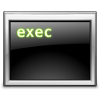

Sometimes I write programs for my purposes, like calculation, simulation, visualisation and visual effects or automatisation. Depending on the challenge, C++, Java, AppleScript or JavaScript is utilised (XHTML, CSS and XML are **NOT** programming languages!). For visualisation I use OpenGL but sometimes I also use the Apple QuartzComposer for developing concepts.

<ul class="list128">
	<li>
		

		

			<h2>[MailWidget](mailwidget/)</h2>
			This is a widget for the Apple Dashboard which checks your Apple Mail accounts. It is written entirely in JavaScript.
		

	</li>
	<li>
		
		

			<h2>[OFF-Model Renderer for Quartz Composer](offmodel/)</h2>
			This plug in for Quartz Composer allows you to use 3D models in your compositions.
		

	</li>
    <li>
		
		

			<h2>[Aqua for everyone](aqua/)</h2>
			A small command line tool which helps to extract graphical elements from the Mac OS X user interface.
		

	</li>
    <li>
		
		

			<h2>[Scripting Faces in iPhoto '09](iphoto09/)</h2>
			This is a little AppleScript collection to give you the ability to script faces, places and events.
		

	</li>
</ul>
