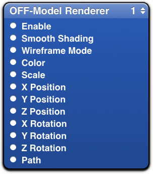
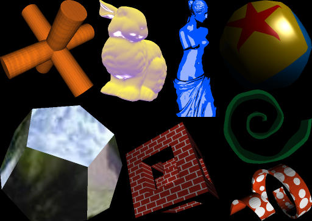

The Quartz Composer offers only some primitives for rendering. Wouldn't it be nice to have the possibility to render 3D models like the above?

With the OFF-Model Renderer you can. Just get the [OFF-Model Renderer Patch for Quartz Composer](http://support.kwasi-ich.de/OFFModel.plugin.zip) (22.7 KiB).

## Requirements ##

To be able to use that plug in you need at least

* Mac OS X 10.5 Leopard
* Quartz Composer 3 (ships with the developer tools provided with Mac OS X 10.5 Leopard)
* Models in the OFF file format

If you have no model present as OFF file, you may want to use [MeshLab](http://meshlab.sourceforge.net/) to convert your model into OFF.

## Installation ##

To install the plug in system wide put OFFModel.plugin into

    /Library/Graphics/Quartz Composer Plug-Ins/

Otherwise to install it only for the current user put it into

    ~/Library/Graphics/Quartz Composer Plug-Ins/

Depending on your system you may need to create those directories but be careful about user privileges. That's it.

## Usage ##

Basically you just need to drop an instance of the OFF-Model Renderer Patch on your Quartz Composition and provide the path to the OFF-file. But then you will only see a uniform coloured silhouette of the model. That is why I recommend you to use the Lighting Environment Patch.

**The OFF-Model Renderer Patch has following inputs:**

<dl>
	<dt>Smooth Shading</dt>
	<dd>(Also called Gouraud Shading) Provides a smoother model. This is done by joining the normals of faces that share the same vertex in that vertex.</dd>
	<dt>Wireframe Mode</dt>
	<dd>Displays your model with all polygons drawn as lines.</dd>
	<dt>Color</dt>
	<dd>Lets you choose the colour of the model. The opacity setting is working but does not provide you the image you may expect since there is no back to front sorting of the polygons. So the opacity is of limited use and therefore not recommended.</dd>
	<dt>Scale</dt>
	<dd>Allows you to adjust the size of the model in the rendered scene.</dd>
	<dt>X, Y, Z Position</dt>
	<dd>Lets you translate the models position in the scene.</dd>
	<dt>X, Y, Z Rotation</dt>
	<dd>Allows you to change the orientation of the model by providing the angles for a fixed-axis rotation.</dd>
	<dt>Path</dt>
	<dd>Path to the OFF file must be absolute POSIX-style paths.Relative paths won't work.</dd>
</dl>

<figure>
    
</figure>

## Limitations ##

OFF (Object File Format) provides only geometry information and does not support texturing or material specifications. Therefore the OFF-Model Renderer also does not provide such features. To achieve some texturing and colouring effects you may want to combine the OFF-Model Renderer with the GLSL Shader patch. Sample compositions with the GLSL Shader patch are installed with the developer tools. Using GLSL Shader combined with the OFF-Model Renderer you can achieve even without support for texturing and material specifications stunning visualisations.

<figure>
    
</figure>
